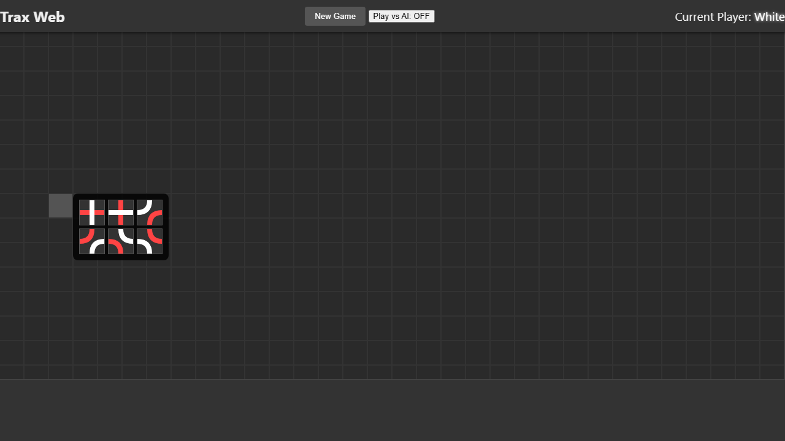
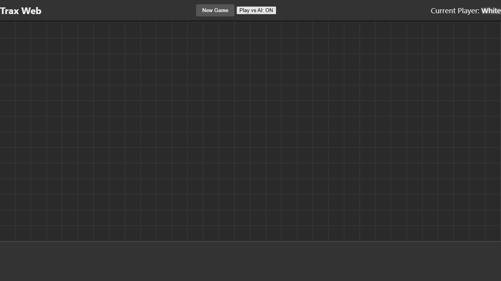

# Trax Web

C#版Trax戦略ゲームWeb移植版です。
JavaScriptによるAIプレイヤーとの対戦機能も搭載しています。

## 遊び方 / 操作方法

1.  最新のWebブラウザで `index.html` を開きます。
2.  **白（White）** が先手です。

### タイルの配置
空いているセルをクリックすると、タイルを配置できます。
-   最初の手番では、任意の場所（通常は中央）をクリックできます。


-   2手目以降は、既存のタイルに隣接する場所に配置する必要があります。

### タイルの向き選択
セルをクリックすると、配置可能なタイルの向きを選択するポップアップが表示されます。配置したい向きをクリックしてください。


### 強制手（Forced Moves）への対応
同じ色のパスが2つ、1つの空きセルに入り込むような配置になった場合、自動的にその空きセルに接続用のタイルが配置されます。これが連鎖的に発生することもあります。

### 禁じ手（Illegal Moves）
同じ色のパスが3つ以上、1つのセルに入り込むような配置（またはその結果生じる強制手）は「禁じ手」となり、そのような手は打てません。

### 勝利条件
-   自分の色の **閉じたループ** を作る。
-   自分の色のパスを **8列または8行** 以上つなげる。

## AI対戦（TraxAI）

コンピュータプレイヤーと対戦できます。AIはアルファベータ法を用いたMiniMaxアルゴリズムで動作します。

### AIの有効化
画面上部の「Play vs AI」ボタンをクリックすることで、AIとの対戦をオン/オフできます。


## 開発とテスト

このプロジェクトは標準的なWeb技術（HTML, CSS, JS）で構築されており、テストには **Jest** と **Playwright** を使用しています。

### セットアップとテスト実行

1.  依存関係のインストール:
    ```bash
    npm install
    ```

2.  ユニットテスト (Jest) の実行:
    ```bash
    npm test
    ```

3.  E2Eテスト (Playwright) の実行:
    ```bash
    npm run test:e2e
    ```

## ルール詳細

詳細は [Trax Rules (Wikipedia)](https://en.wikipedia.org/wiki/Trax_(game)) を参照してください。
